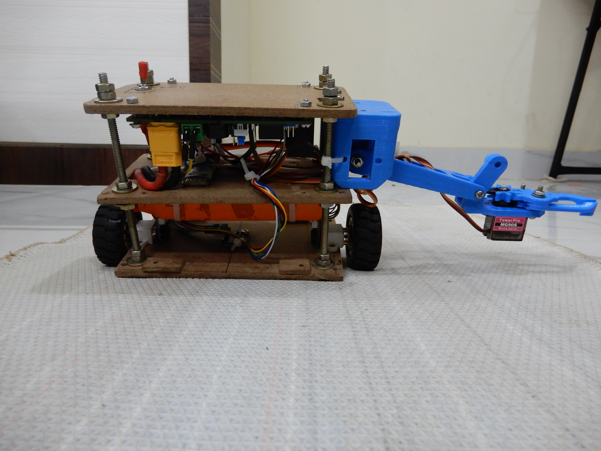
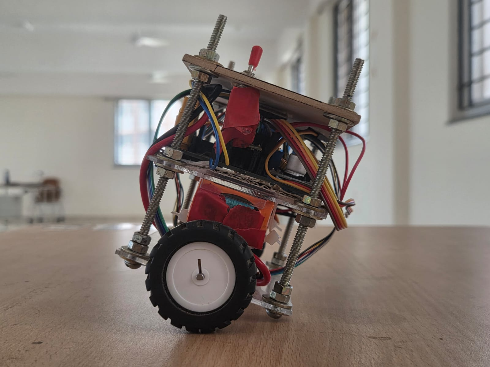
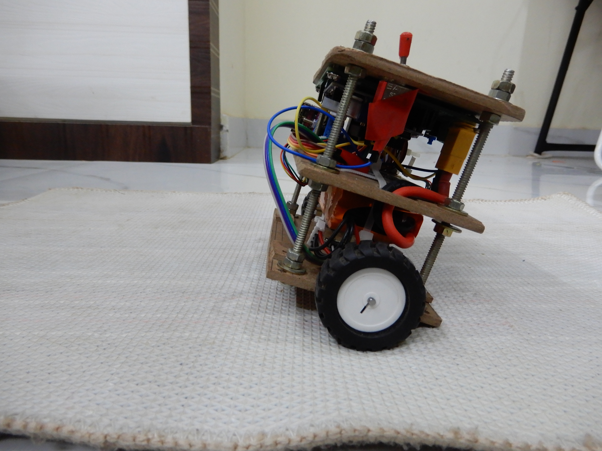

# 🌾 Krishi Balancer — eYRC 2025-26 | Team KB#2155

> **Self-balancing two-wheeled robot** designed and built for the **e-Yantra Robotics Competition 2025-26**, IIT Bombay.  
> Theme: *Krishi Balancer* — precision balance control for agricultural automation scenarios.

---

## 👥 Team

| Name | Branch |
|------|--------|
| **Prathamesh Nerpagar** ⭐ *(Team Lead)* | EEE, IIT Dharwad |
| **Aadhi Shankar** | Mech, IIT Dharwad |
| **Balamurali V B** | Mech, IIT Dharwad |
| **Sameer Chakravarti** | CSE, IIT Dharwad |

**Institution:** IIT Dharwad  
**Team ID:** KB#2155 | **Stage 2 qualifier**

---

## 📁 Repository Structure

```
krishi-balancer/
├── README.md                        ← You are here
├── .gitignore
│
├── arduino/
│   └── PID.ino                      ← Main firmware (1100+ lines)
│
├── docs/
│   └── circuit_notes.md             ← Pin maps, wiring, calibration
│
├── images/
│   ├── Front_view.jpg
│   ├── Back_side_view.jpg
│   ├── Left_side_view.jpg
│   ├── Right_side_view.jpg
│   └── Top_view.jpg
│
├── simulation/
│   ├── Task2A.mp4                   ← Webots simulation Task 2A
│   └── Task2B.mp4                   ← Webots simulation Task 2B
│
└── videos/
    └── Task3C.mp4                   ← Hardware live demo Task 3C
```

---

## 🤖 Robot Hardware

### Physical Build

| Parameter | Value |
|-----------|-------|
| Chassis | 3-layer MDF (laser-cut) |
| Wheel diameter | 43 mm |
| Wheel base | ~100 mm |
| Drive motors | 2× N20 300 RPM DC gear motors |
| Encoder resolution | ~6170 ticks / revolution |
| Arm | Blue PLA 3D-printed, 2× TowerPro MG90S servos |
| Total weight (est.) | ~350 g |

### Electronics

| Component | Specification | Notes |
|-----------|--------------|-------|
| Microcontroller | Arduino Nano (ATmega328P) | 16 MHz, 5V |
| IMU | MPU6050 (GY-521 module) | I2C @ 400 kHz fast mode |
| Motor driver | L298N dual H-bridge | `botController v1.1` |
| Power | 7.4 V 2S LiPo, ~1200 mAh | Powers motors + Nano via onboard 5V reg |
| Bluetooth | HC-05 module | 9600 baud, UART pins D12/D13 |
| Buzzer | Active buzzer | A1 (startup calibration beeps) |
| Servo | TowerPro MG90S × 2 | A0 pin via Servo library |
| Switch | SPST power switch | Inline on LiPo positive lead |

### Photo Gallery

| Front | Back | Left |
|-------|------|------|
|  |  |  |

| Right | Top |
|-------|-----|
|  |  |

---

## 🎥 Task Videos

| Task | Description | Link |
|------|-------------|------|
| Task 2A | Webots simulation — balancing in place | [simulation/Task2A.mp4](simulation/Task2A.mp4) |
| Task 2B | Webots simulation — forward/backward motion + yaw | [simulation/Task2B.mp4](simulation/Task2B.mp4) |
| Task 3C | Hardware live demo — full balancing + Bluetooth control | [videos/Task3C.mp4](videos/Task3C.mp4) |

---

## 🧠 Control System Architecture

The robot uses a **three-loop cascaded PID architecture** running entirely on the Arduino Nano.

### Loop Overview

| Loop | Controller | Rate | Input | Output |
|------|-----------|------|-------|--------|
| **Outer — Velocity** | PI | 20 Hz (50 ms) | Encoder ticks | Target angle offset Δθ |
| **Inner — Angle** | PID | 100 Hz (10 ms) | IMU pitch angle | Motor PWM command u_θ |
| **Yaw** | PI | 20 Hz (50 ms) | Gyro gz rate | Differential PWM u_ψ |

### How the Cascade Works

```
Dabble App (BT)
    │
    ├─ v_ref ──► [Σ e_v] ──► Velocity PI ──► ±3° limit ──► Δθ_ref
    │                ▲                                          │
    │            v_meas                                         ▼
    │          (encoder)                              [Σ e_θ] = θ_ref − θ_meas
    │                                                     │
    │            θ_base (−1.1°, CoG trim) ────────► [Σ] ──┘
    │                                                     │
    │                                                     ▼
    │                                            Angle PID (100 Hz)
    │                                          Kp·e − Kd·ω
    │                                                     │
    │                                                ±80 PWM limit
    │                                                     │
    ├─ ψ_ref ──► [Σ e_ψ] ──► Yaw PI ──► ±30 limit ──► u_ψ
    │                ▲                                     │
    │           ψ̇_meas                                    ▼
    │           (gyro gz)                       Motor Mix:
    │                                           L = −(u_θ + u_ψ)
    │                                           R = −(u_θ − u_ψ)
    │                                                     │
    │                                              L298N Driver
    │                                                     │
    └─────────────────────────────────────── Plant (Robot) ◄┘
                                             θ(t), ψ(t), v(t) fed back
```

### Key Design Decisions

**1. D-term uses raw gyro rate (not differentiated angle)**  
Differentiating the noisy filtered angle amplifies noise by 100×. The gyro directly outputs `ω` (angular velocity), so:
```
D_term = −Kd × gyro_rate
```
This gives a clean braking force proportional to how fast the robot is falling, applied before the angle error grows large.

**2. Outer loop outputs an angle offset, not direct PWM**  
The velocity controller outputs `Δθ_ref` — a small tilt target. If the robot needs to accelerate forward, it leans slightly forward. This is physically correct: a self-balancing robot accelerates by tilting.

**3. Yaw uses gyro gz, not encoders**  
The right encoder (PCINT-based) misses ~96% of pulses at N20 motor speed. Yaw control uses `gyro_gz` instead, which is reliable and drift is negligible at 20 Hz correction rate.

**4. I2C at 400 kHz (Fast Mode)**  
Default I2C is 100 kHz → MPU6050 read takes ~1.4 ms. At 400 kHz it takes ~0.35 ms, freeing ~1 ms per inner loop cycle (critical at 100 Hz).

---

## 📐 Sensor Fusion — Complementary Filter

### Algorithm

The pitch angle is estimated by fusing gyroscope and accelerometer data:

```
θ_acc[n] = atan2(raw_ay, raw_az) × (180/π)          // accelerometer tilt
ω[n]     = (raw_gx − gyro_offset) / 131.0            // gyro rate [deg/s]

θ[n] = 0.96 × (θ[n-1] + ω[n] × dt) + 0.04 × θ_acc  // complementary filter
```

### Why These Weights?

| Weight | Signal | Characteristic |
|--------|--------|---------------|
| α = 0.96 | Gyroscope | High-pass: accurate short-term, **drifts** long-term |
| 1−α = 0.04 | Accelerometer | Low-pass: noisy short-term, **no drift** long-term |

The cutoff frequency:
```
f_c = (1 − α) / (2π × dt) = 0.04 / (2π × 0.01) ≈ 0.637 Hz
```
Signals **faster than 0.637 Hz** → trusted from gyroscope.  
Signals **slower than 0.637 Hz** → corrected by accelerometer (eliminates drift).

### Why Not a Kalman Filter?

| Filter | Accuracy | CPU time / cycle |
|--------|----------|-----------------|
| Complementary | baseline | ~10 µs |
| Kalman | +5% | ~40 µs |

At 100 Hz inner loop, saving 30 µs/cycle × 100 = 3 ms/second matters. The 5% accuracy gain does not justify the overhead on an ATmega328P.

---

## ⚙️ PID Parameters

### Angle Controller (Inner Loop, 100 Hz)

| Parameter | Value | Notes |
|-----------|-------|-------|
| `Kp_angle` | 45.0 | Main stiffness |
| `Kd_angle` | 0.8 | Damping (uses gyro rate, not de/dt) |
| `Ki_angle` | 0.0 | Disabled — integral windup unstable at 100 Hz |
| Saturation | ±80 PWM | Prevents motor saturation |

### Velocity Controller (Outer Loop, 20 Hz)

| Parameter | Value | Notes |
|-----------|-------|-------|
| `Kp_vel` | 0.025 | Low gain — outer loop must be slower than inner |
| `Ki_vel` | 0.01 | Removes steady-state velocity error |
| Saturation | ±3° | Limits angle offset from velocity error |

### Yaw Controller (Yaw Loop, 20 Hz)

| Parameter | Value | Notes |
|-----------|-------|-------|
| `Kp_yaw` | 1.5 | Yaw stiffness |
| `Ki_yaw` | 0.3 | Removes heading drift |
| Saturation | ±30 PWM | Differential PWM limit |

### Tuning History

| Attempt | Kp | Kd | Result |
|---------|----|----|--------|
| 1 | 25.0 | 0.5 | Oscillated — too low Kp, robot couldn't recover |
| 2 | 60.0 | 0.5 | Saturated at 400–700 PWM, PWM clamp too low |
| 3 | 45.0 | 0.5 | Stable but jerky with arm — arm adds rotational inertia |
| **Final** | **45.0** | **0.8** | Stable. Kd raised 0.5→0.8 to compensate arm inertia |

---

## 🔌 Pin Map

### Motor Driver (L298N)

| Arduino Pin | Function |
|-------------|----------|
| D6 (ENA) | Left motor PWM enable |
| A2 (IN1) | Left motor direction A |
| A3 (IN2) | Left motor direction B |
| D5 (ENB) | Right motor PWM enable |
| D9 (IN3) | Right motor direction A |
| D4 (IN4) | Right motor direction B |

> `RIGHT_MOTOR_INVERTED = true` — right motor wired in reverse, corrected in firmware.

### Encoders

| Arduino Pin | Interrupt Type | Function |
|-------------|---------------|----------|
| D2 (INT0) | Hardware interrupt | Left encoder channel A |
| D3 (INT1) | Hardware interrupt | Left encoder channel B |
| D7 | PCINT (unreliable) | Right encoder channel A |
| D8 | PCINT (unreliable) | Right encoder channel B |

> ⚠️ **Right encoder PCINT issue:** At N20 motor speed (~300 RPM × gear ratio), PCINT interrupts miss ~96% of pulses due to timing conflicts with the PWM timer. Yaw is controlled via `gyro_gz` instead.

### IMU & Peripherals

| Arduino Pin | Function |
|-------------|----------|
| A4 (SDA) | MPU6050 I2C data |
| A5 (SCL) | MPU6050 I2C clock |
| A1 | Active buzzer |
| A0 | Servo signal (arm) |
| D12 | HC-05 RX (software serial) |
| D13 | HC-05 TX (software serial) |

---

## 🚀 Setup & Getting Started

### Hardware Requirements

- Arduino Nano (ATmega328P)
- MPU6050 IMU module (GY-521)
- L298N dual H-bridge motor driver
- 2× N20 300 RPM DC gear motors with encoders
- HC-05 Bluetooth module
- 7.4V 2S LiPo battery
- Active buzzer
- 2× TowerPro MG90S micro servos (arm)

### Software Dependencies

Install these Arduino libraries via Library Manager:

```
Wire          — built-in (I2C for MPU6050)
Dabble        — v1.4+ (Bluetooth gamepad protocol)
Encoder       — Paul Stoffregen's Encoder library
Servo         — built-in
SoftwareSerial — built-in (HC-05)
```

### Arduino IDE Settings

| Setting | Value |
|---------|-------|
| Board | Arduino Nano |
| Processor | ATmega328P (Old Bootloader) |
| Port | COMx / /dev/ttyUSB0 |
| Upload speed | 115200 |

### Uploading

```bash
# Via Arduino IDE:
# 1. Open arduino/PID.ino
# 2. Select Board → Arduino Nano
# 3. Select Processor → ATmega328P (Old Bootloader)
# 4. Click Upload
```

### Power-On Sequence

| Step | Indicator | Action |
|------|-----------|--------|
| 1 | 🔊 1 long beep | Gyro calibration started (keep robot still, ~4 s) |
| 2 | 🔊 2 beeps | Calibration done — hold robot **vertical** |
| 3 | 🔊 2 short beeps | Release — robot begins balancing |
| 4 | Robot balances | Connect Dabble app via Bluetooth |

> ⚠️ If robot falls (|θ| > 45°): motors stop automatically. Place vertical and wait 1 second — it auto-resumes if |θ| < 5°.

---

## 📱 Bluetooth Control (Dabble App)

Download **Dabble** (iOS/Android). Connect to HC-05 (default PIN: `1234`).

| Control | Action |
|---------|--------|
| D-Pad ↑ | Increase forward velocity setpoint |
| D-Pad ↓ | Increase reverse velocity setpoint |
| D-Pad ← | Negative yaw setpoint (turn left) |
| D-Pad → | Positive yaw setpoint (turn right) |
| △ Triangle | Increase `Kp_angle` by +1.0 (live tuning) |
| ✕ Cross | Decrease `Kp_angle` by −1.0 (live tuning) |
| ○ Circle | Increase `θ_base` by +0.1° (drift correction) |
| □ Square | Decrease `θ_base` by −0.1° (drift correction) |

---

## 🔧 Calibration Procedures

### Gyro Bias Calibration (Automatic on boot)

At startup, the firmware samples 2000 gyro readings over ~4 seconds with the robot stationary:

```cpp
for (int i = 0; i < 2000; i++) {
    read_MPU6050();
    gyro_offset += raw_gx;
    delay(2);
}
gyro_offset /= 2000;  // Target: < ±200 LSB
```

### Encoder Ticks-per-Revolution Calibration

1. Mark a point on the wheel with tape
2. Rotate wheel **exactly one full turn** by hand
3. Read encoder count via Serial Monitor
4. Update `TICKS_PER_REV` constant (measured: ~6170)

### Motor Asymmetry Calibration

If robot drifts despite zero velocity setpoint:

```cpp
// Set in firmware:
#define LEFT_MOTOR_SCALE   1.00f   // adjust if left faster
#define RIGHT_MOTOR_SCALE  0.97f   // adjust if right faster
```

### CoG (Centre of Gravity) Trim

If robot leans without balancing:

```cpp
float baseTargetAngle = -1.1f;  // degrees — adjust ±0.5° steps
```
Negative = robot leans slightly forward to counter rear-heavy arm.

---

## 📊 Serial Debug Output

Connect at **115200 baud**. Output format:
```
P:-0.8 T:-1.1 M:23 G:-2
│      │      │    └── Gyro gz raw [LSB/s]
│      │      └─────── Motor command PWM
│      └────────────── Target angle (base + Δθ_ref)
└───────────────────── Current pitch angle [°]
```

### Example Healthy Output
```
P:-1.0 T:-1.1 M: 5 G: 1    ← barely correcting, near balance
P:-0.8 T:-1.1 M:18 G:-3    ← small forward lean, correcting
P:-2.1 T:-1.1 M:67 G:-12   ← pushed — high motor command
P:-1.0 T:-1.1 M: 8 G: 2    ← recovering
```

---

## 📋 Firmware Constants Reference

```cpp
// ── Timing ────────────────────────────────────────────────────
#define INNER_LOOP_US       10000     // Inner loop period: 10 ms (100 Hz)
#define OUTER_LOOP_MS       50        // Outer loop period: 50 ms (20 Hz)
#define YAW_LOOP_MS         50        // Yaw loop period:  50 ms (20 Hz)

// ── Sensor ────────────────────────────────────────────────────
#define GYRO_SENSITIVITY    131.0f    // LSB per deg/s (±250°/s range)
#define COMP_ALPHA          0.96f     // Complementary filter weight
#define GYRO_CAL_SAMPLES    2000      // Calibration sample count

// ── Mechanical ────────────────────────────────────────────────
#define TICKS_PER_REV       6170      // Encoder ticks per wheel revolution
#define WHEEL_DIAMETER_M    0.043f    // Wheel diameter in metres
#define RIGHT_MOTOR_INVERTED true     // Right motor wired backwards

// ── Safety ────────────────────────────────────────────────────
#define FALL_ANGLE          45.0f     // |θ| > this → stop motors
#define RESUME_ANGLE        5.0f      // |θ| < this → resume (after fall)
#define RESUME_DELAY_MS     1000      // Wait 1 s after uprighting to resume

// ── Motor ─────────────────────────────────────────────────────
#define PWM_MAX             80        // Max motor PWM magnitude
#define PWM_DEADBAND        15        // Below this PWM → motors off
```

---

## 🐛 Known Issues & Hardware Quirks

| Issue | Root Cause | Workaround |
|-------|-----------|------------|
| Right encoder misses ~96% pulses | Timer2 PWM conflicts with PCINT on D7/D8 | Yaw controlled via `gyro_gz` instead |
| Right motor runs backwards | Motor wired in reverse during assembly | `RIGHT_MOTOR_INVERTED = true` in firmware |
| HC-05 conflicts with encoder ISR | PCINT vector shared with D12/D13 on Nano | HC-05 moved to pins D12/D13 using SoftwareSerial |
| Arm destabilises balance at Kd=0.5 | Arm adds ~15% to rotational inertia | Kd raised to 0.8 |
| Robot drifts slowly left | Slight asymmetry in N20 motor RPM | `RIGHT_MOTOR_SCALE = 0.97` in firmware |
| I2C slow at 100 kHz | Default Wire library speed | Added `Wire.setClock(400000)` in setup |

---

## 🗂️ Task Summary

### Task 2A — Simulation: Basic Balancing (Webots)
Implemented complementary filter and inner angle PID loop in Python/Webots. Robot balances in place with no external disturbances.

### Task 2B — Simulation: Motion Control (Webots)
Added outer velocity loop and yaw control. Robot responds to keyboard commands — forward, backward, and turn in simulation.

### Task 3C — Hardware: Full Balancing Demo
All three control loops running on Arduino Nano hardware. Robot balances, moves via Bluetooth Dabble app, and recovers from pushes.

---

## 📚 References

- MPU6050 Register Map — InvenSense RM-MPU-6000A Rev 4.2
- Complementary filter theory — Mahony, R. et al., *Nonlinear Complementary Filters on the Special Orthogonal Group*, IEEE TAC 2008
- PID control for inverted pendulum — Ogata, K., *Modern Control Engineering*, 5th ed.
- e-Yantra 2025-26 problem statement — [e-yantra.org](https://www.e-yantra.org)

---

## 📝 License

This repository is **private** during the eYRC 2025-26 competition. Code and documentation © Team KB#2155.  
After competition closure, may be open-sourced under MIT License.

---

<div align="center">

**eYRC 2025-26  ·  Team KB#2155  ·  Krishi Balancer  ·  IIT Bombay**

*Prathamesh Nerpagar · Aadhi Shankar · Balamurali V B · Sameer Chakravarti*

</div>
